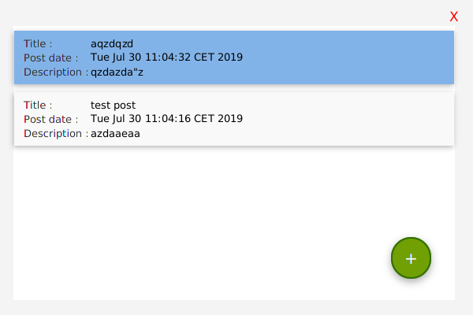
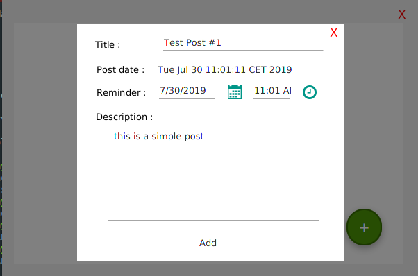
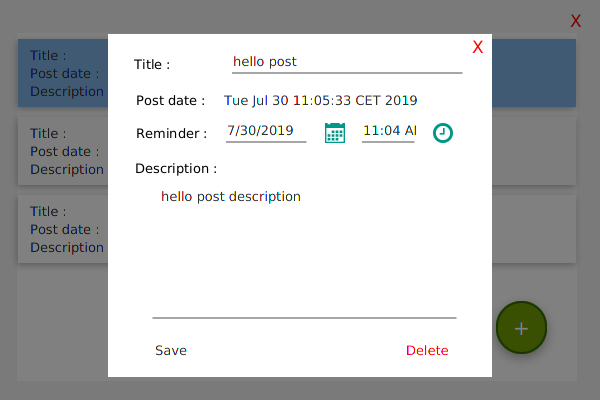
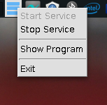

# Posts Reminder
A JavaFX app that alow users to create posts and add reminder to it so that the app will show a notification at the selected reminder time and allow users to edit and delete posts also they can stop the service and hide the program in system tray

## What I Learned
- Create Local Database in file
- CRUD operations on the database
- Create System tray icon and menu
- Display Notification for users 

## Screenshots 

## To run
1. Download the release file  
2. Make sure you have oracle jre v 8 or higher
3. type in command line or terminal ` java -jar <filename>.jar `
